# Flight Booking System - How It Works in the Real World

## Overview

This document explains how real-world flight booking systems (like Expedia, Booking.com, Kayak, Google Flights) actually work, and how our architecture implements these patterns.

## Key Insight: You Don't Own the Flights! 🎯

**The fundamental difference** between a flight booking system and other booking systems (hotels, events, appointments):

- **Hotels/Events**: You often own or directly manage the inventory
- **Flights**: Airlines own the inventory, you're an intermediary/aggregator

This changes everything about the architecture!

## The Flight Booking Ecosystem

### 1. The Players

```
┌─────────────────────────────────────────────────────────────┐
│                     AIRLINES                                 │
│  (American, United, Delta, Southwest, etc.)                  │
│  • Own the planes and seats                                  │
│  • Set prices dynamically                                    │
│  • Control inventory                                         │
└────────────────────┬────────────────────────────────────────┘
                     │
                     ▼
┌─────────────────────────────────────────────────────────────┐
│              GDS PROVIDERS (Middlemen)                       │
│  Amadeus, Sabre, Travelport                                  │
│  • Aggregate inventory from 400+ airlines                    │
│  • Provide standardized APIs                                 │
│  • Handle complex booking logic                              │
│  • Charge per transaction (~$0.50-2.00)                      │
└────────────────────┬────────────────────────────────────────┘
                     │
                     ▼
┌─────────────────────────────────────────────────────────────┐
│         YOUR FLIGHT BOOKING PLATFORM                         │
│  (Like Expedia, Kayak, Google Flights)                       │
│  • Search aggregation                                        │
│  • User interface                                            │
│  • Payment processing                                        │
│  • Customer service                                          │
│  • Earn commission or markup                                 │
└────────────────────┬────────────────────────────────────────┘
                     │
                     ▼
┌─────────────────────────────────────────────────────────────┐
│                   END USERS                                  │
│  • Search and compare flights                                │
│  • Book tickets                                              │
│  • Manage bookings                                           │
└─────────────────────────────────────────────────────────────┘
```

### 2. What is GDS? (Global Distribution System)

Think of GDS as the "Uber for Airlines":

**Without GDS**:
- You'd need to integrate with 400+ individual airline APIs
- Each airline has different formats, protocols, rules
- Maintenance nightmare

**With GDS**:
- One API integration gives you access to 400+ airlines
- Standardized request/response formats
- Amadeus alone covers 90% of commercial flights worldwide

**Major GDS Providers**:

| Provider | Market Share | Strong In | API Type |
|----------|--------------|-----------|----------|
| Amadeus | 40% | Europe, Asia, Latin America | REST + SOAP |
| Sabre | 35% | North America | REST + SOAP |
| Travelport | 25% | Global | XML-based |

**Cost Model**:
- Pay per search: $0.10-0.50
- Pay per booking: $1.00-2.00
- Monthly subscription: $500-5,000+

## How Flight Search Actually Works

### Real-World Search Flow


### Why Short Cache TTL (5 minutes)?

Flight prices are **incredibly volatile**:
- Prices update every 1-5 minutes based on demand
- Seats sell out in real-time
- Airlines use dynamic pricing algorithms
- Can't show stale prices or you'll lose money

### The Search Request

**What you send to GDS**:
```json
{
  "origin": "JFK",
  "destination": "LAX",
  "departureDate": "2025-12-15",
  "returnDate": "2025-12-22",
  "adults": 2,
  "children": 0,
  "cabinClass": "ECONOMY",
  "nonStop": false
}
```

**What you get back**:
- 50-200 flight combinations
- Multiple airlines (United, American, Delta, JetBlue...)
- Direct and connecting flights
- Different fare types (Basic, Main, Flexible)
- Real-time prices
- Current availability

**The Challenge**:
- GDS responses are SLOW (2-5 seconds)
- Solution: Aggressive caching + parallel queries

## How Flight Booking Actually Works

### The PNR (Passenger Name Record)

**PNR is the heart of airline bookings**:
- A 6-character code (e.g., ABC123)
- Created in the GDS, shared with airlines
- Contains all booking information
- Think of it like a shopping cart that gets saved

**PNR Lifecycle**:

```
1. CREATE PNR (Unpaid Hold)
   ↓
   Creates reservation in airline system
   Holds seats for 24-48 hours
   No payment yet
   
2. PAYMENT
   ↓
   Customer pays you
   
3. TICKET ISSUANCE
   ↓
   GDS issues e-ticket
   Charges your account
   E-ticket sent to airline
   BOOKING IS NOW CONFIRMED
   
4. TRAVEL
   ↓
   Passenger checks in
   Boards plane
   Flies
```

### The Critical Booking Flow

```mermaid
sequenceDiagram
    participant User
    participant You as Your Platform
    participant Amadeus as Amadeus GDS
    participant Airline as Airline System
    participant Payment as Payment Gateway
    
    Note over User,Airline: User selects flight ($456.80)
    
    User->>You: Book this flight
    You->>Amadeus: Verify price (Flight Price API)
    Amadeus->>Airline: Check current price
    Airline-->>Amadeus: Still $456.80 ✓
    Amadeus-->>You: Price confirmed
    
    Note over User: User enters passenger details
    
    You->>Amadeus: Create PNR (Flight Order API)
    Amadeus->>Airline: Reserve seats
    Airline-->>Amadeus: Seats held (24hrs)
    Amadeus-->>You: PNR: ABC123
    
    You->>Payment: Charge $456.80
    Payment-->>You: Payment successful
    
    You->>Amadeus: Issue ticket
    Amadeus->>Airline: Create e-ticket
    Airline-->>Amadeus: Ticket: 001-2345678901
    Amadeus-->>You: Ticketing complete
    
    You->>User: Booking confirmed! ✈️
```



### Why Price Verification is Critical

**Scenario without price verification**:

1. User sees flight for $400 (5 min old cached price)
2. User clicks "Book"
3. You create PNR
4. Actual current price is $550 (+$150!)
5. Who pays the difference? 😱

**Solution**: Always verify price before creating PNR

### The Saga Pattern (Distributed Transaction)

Booking a flight involves multiple systems that can fail:

```
Step 1: Verify Price (Amadeus)
  ↓ Success
Step 2: Create PNR (Amadeus)
  ↓ Success
Step 3: Charge Payment (Stripe)
  ↓ FAILURE! 💥
Step 4: COMPENSATE - Cancel PNR (Amadeus)
  ↓
Step 5: Notify user (payment failed)
```

**Without compensation**:
- PNR created but not paid
- Seats held unnecessarily
- Airline charges you later
- You lose money

**With Saga Pattern**:
- Automatic rollback on failure
- Cancel unpaid PNRs
- Release inventory
- Clean system state

## NDC: The New Way (Direct to Airlines)

### What is NDC?

**NDC (New Distribution Capability)**:
- Created by IATA (airline industry org)
- Direct API connection to airlines
- Bypasses GDS middleman
- Growing adoption since 2015

### GDS vs NDC

| Aspect | GDS (Traditional) | NDC (Modern) |
|--------|-------------------|---------------|
| **Connection** | GDS → Many Airlines | Your App → One Airline |
| **Cost** | $1-2 per booking | Lower or FREE |
| **Content** | Standard fares | Exclusive offers |
| **Integration** | 1 integration = 400 airlines | 1 integration = 1 airline |
| **Ancillaries** | Limited | Full (seats, bags, meals) |
| **Rich Media** | No | Yes (seat maps, photos) |
| **Adoption** | 100% of airlines | ~40 major airlines |

### When to Use What?

**Use GDS (Amadeus/Sabre)**:
- Starting out (fastest to market)
- Need broad airline coverage
- Don't have dev resources for many integrations

**Use NDC**:
- Want better margins
- Target specific airlines
- Want exclusive content
- Have development resources

**Best Strategy** (What big OTAs do):
```
Primary: GDS (Amadeus)
  → 80% of searches
  → Broad coverage
  → Single integration
  
Secondary: NDC Direct APIs
  → 20% of searches
  → Major airlines (United, Delta, American)
  → Better deals, exclusive fares
  
Low-Cost Carriers: Direct APIs
  → Southwest, Ryanair (not in GDS)
  → Scraping or direct partnerships
```

## Revenue Models

### How Do You Make Money?

**1. Commission Model** (Traditional):
```
Flight base fare: $400
Your commission: 3-5% = $12-20
User pays: $400
You earn: $12-20
Airline pays you commission
```

**2. Markup Model** (Modern):
```
GDS price: $400
Your markup: $10-50
User pays: $410-450
You earn: $10-50
You pay GDS: $400 + fees
```

**3. Service Fee Model**:
```
Flight price: $400
Booking fee: $15
User pays: $415
You earn: $15
Transparent to customer
```

**4. Hybrid Model** (Most common):
```
Small markup: $10
Ancillary services: $25 (seat selection, insurance)
Advertising revenue: $5
Total revenue per booking: $40
```

## Technical Challenges & Solutions

### 1. Cache Invalidation

**Problem**: Flight prices change constantly

**Solution**:
```javascript
// Short TTL for search results
redis.setex(`search:${route}:${date}`, 300, results) // 5 min

// Very short TTL for specific offers
redis.setex(`offer:${offerId}`, 60, offer) // 1 min

// Always verify price before booking
const currentPrice = await gds.verifyPrice(offerId)
if (currentPrice !== cachedPrice) {
  notify("Price changed!")
}
```

### 2. GDS Performance

**Problem**: GDS APIs are SLOW (2-5 seconds)

**Solutions**:
- Parallel queries to multiple GDS
- Aggressive caching
- Async loading (show results as they come)
- Pre-fetch popular routes

### 3. Rate Limits

**Problem**: GDS charges per API call

**Solutions**:
- Smart caching (reduce duplicate queries)
- Batch similar searches
- Use cached/near-real-time APIs when available
- Monitor and optimize API usage

### 4. Error Handling

**Problem**: Many points of failure

**Solutions**:
- Retry with exponential backoff
- Circuit breaker pattern
- Fallback to alternative GDS
- Graceful degradation

## Our Architecture Implementation

### What We've Built

✅ **Search Service** - Aggregates from GDS (Amadeus, Sabre)  
✅ **GDS Adapter Layer** - Normalizes different GDS formats  
✅ **Booking Service** - PNR creation and management  
✅ **Saga Pattern** - Handle distributed transactions  
✅ **Caching Strategy** - Redis with smart TTLs  
✅ **Payment Integration** - Secure payment processing  
✅ **Notification System** - Email/SMS confirmations  

### Complete Flow in Our System

```
1. User searches flights
   → Search Service queries Amadeus GDS
   → Cache results (5 min)
   → Display to user

2. User selects flight
   → Verify price (real-time)
   → Show current availability

3. User enters passenger details
   → Validate passport, DOB, etc.

4. Create booking (Saga Pattern)
   → Create PNR in Amadeus
   → Process payment via Stripe
   → If payment fails: Cancel PNR
   → If payment succeeds: Issue ticket

5. Confirmation
   → Send email with e-ticket
   → Send SMS confirmation
   → Store in database
   → Update analytics

6. Post-booking
   → Check-in (24 hrs before)
   → Seat selection
   → Manage booking
   → Cancellations/refunds
```

## Next Steps for Implementation

### Phase 1: MVP (Minimum Viable Product)
1. ✅ Architecture design (done!)
2. Register with Amadeus for Test API credentials
3. Implement Search Service with Amadeus SDK
4. Implement Booking Service (PNR creation)
5. Build basic UI for search + booking
6. Test with Amadeus test environment

### Phase 2: Production Ready
1. Payment gateway integration (Stripe)
2. Notification service (SendGrid, Twilio)
3. Database schema implementation
4. Error handling and retry logic
5. Monitoring and logging
6. Production GDS credentials

### Phase 3: Scale
1. Add Sabre as secondary GDS
2. Implement NDC for major airlines
3. Advanced caching strategies
4. Performance optimization
5. Analytics and reporting
6. Customer support tools

## Resources

### Get Started with Amadeus
- **Amadeus for Developers**: https://developers.amadeus.com/
- **Free Test API**: Self-service registration
- **Documentation**: Excellent REST API docs
- **SDKs**: Node.js, Python, Java, Ruby

### Learn More
- IATA NDC Program: https://www.iata.org/ndc
- Sabre Dev Studio: https://developer.sabre.com/
- Travelport Universal API: https://developer.travelport.com/

---

## Summary

Building a flight booking system is fundamentally different from other booking systems because:

1. **You don't own the inventory** - Airlines do
2. **You need GDS integration** - Can't connect to airlines directly
3. **Prices change constantly** - Cache carefully
4. **PNR management is complex** - Use proven patterns
5. **Multiple points of failure** - Implement Saga pattern
6. **Revenue comes from markup/fees** - Not from owning the product

Our architecture handles all of this with:
- GDS integration layer
- Smart caching
- Saga pattern for bookings
- Proper error handling
- Scalable microservices

You're now ready to build a production-grade flight booking system! ✈️
