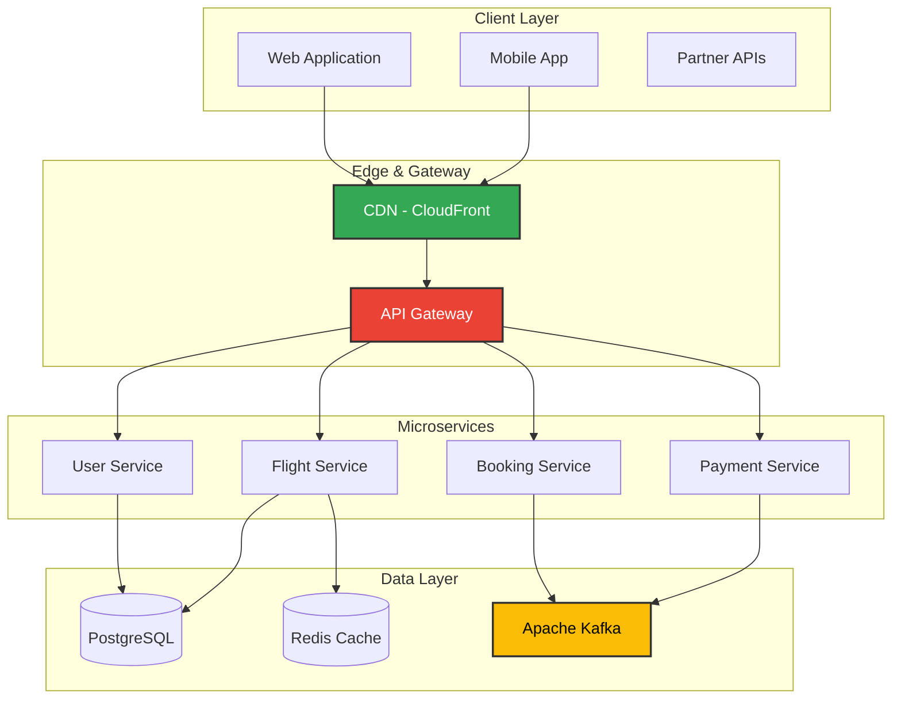
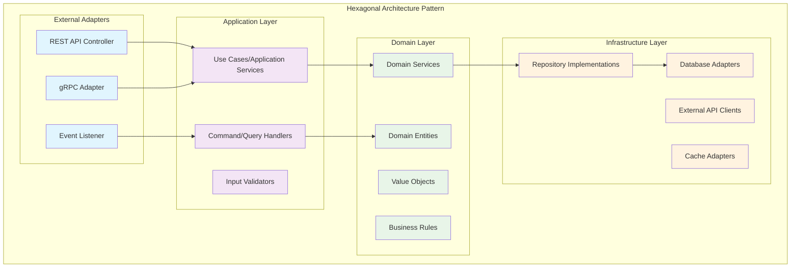
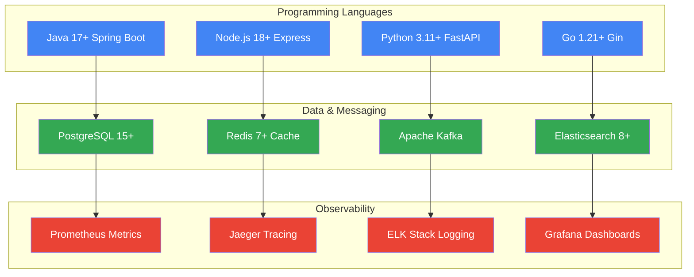
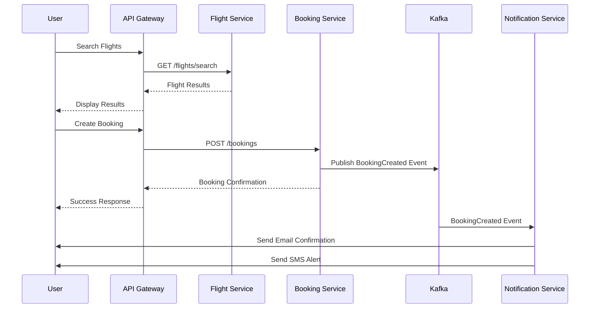
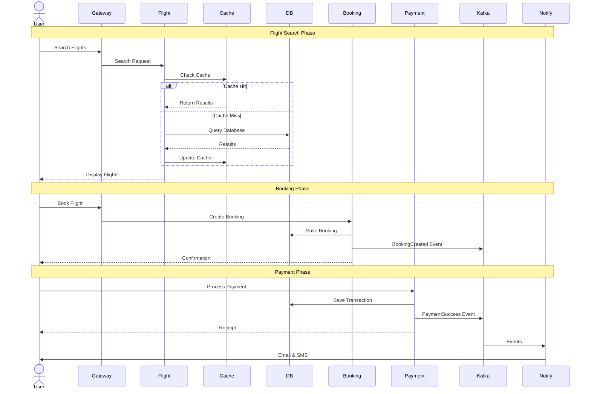
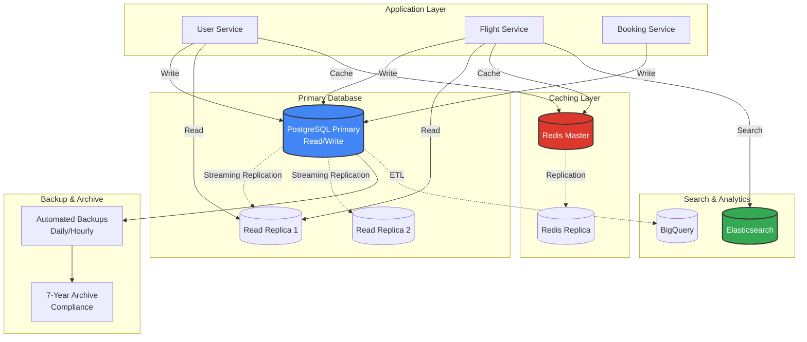
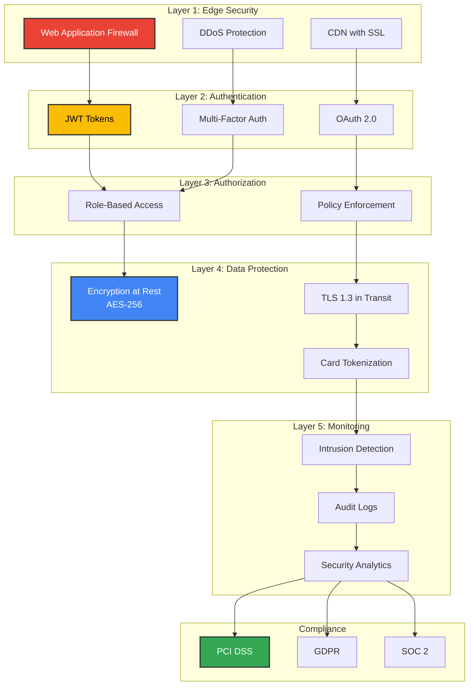
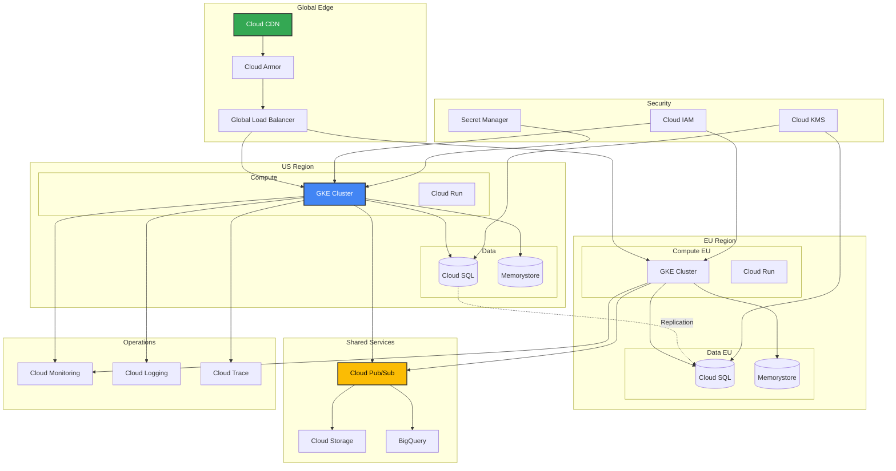
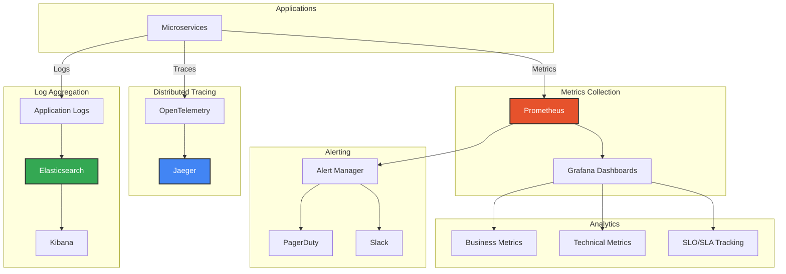

```mermaid
graph LR
    subgraph "Source"
        GIT[Git Repository]
    end
    
    subgraph "Build"
        TRIGGER[Cloud Build Trigger]
        COMPILE[Build & Compile]
        TEST[Unit Tests]
        SCAN[Security Scan]
    end
    
    subgraph "Artifact"
        REGISTRY[Container Registry]
    end
    
    subgraph "Deploy Staging"
        STG[Staging GKE]
        SMOKE[Smoke Tests]
    end
    
    subgraph "Deploy Production"
        APPROVAL[Manual Approval]
        CANARY[Canary 10%]
        BLUE_GREEN[Blue-Green Deploy]
        MONITOR[Health Monitoring]
    end
    
    subgraph "Post-Deploy"
        VERIFY[Verification Tests]
        ROLLBACK{Success?}
        COMPLETE[Deployment Complete]
    end

    GIT -->|Push| TRIGGER
    TRIGGER --> COMPILE
    COMPILE --> TEST
    TEST --> SCAN
    SCAN -->|Pass| REGISTRY
    
    REGISTRY --> STG
    STG --> SMOKE
    SMOKE -->|Pass| APPROVAL
    
    APPROVAL -->|Approved| CANARY
    CANARY --> BLUE_GREEN
    BLUE_GREEN --> MONITOR
    MONITOR --> VERIFY
    
    VERIFY --> ROLLBACK
    ROLLBACK -->|Yes| COMPLETE
    ROLLBACK -->|No| BLUE_GREEN

    style GIT fill:#4285f4,stroke:#333,stroke-width:2px,color:#fff
    style REGISTRY fill:#34a853,stroke:#333,stroke-width:2px,color:#fff
    style APPROVAL fill:#fbbc04,stroke:#333,stroke-width:2px,color:#000
    style ROLLBACK fill:#ea4335,stroke:#333,stroke-width:2px,color:#fff
```

# Flight Booking System - Visual Architecture Guide

This document provides a comprehensive visual overview of the Flight Booking System architecture using Mermaid diagrams.

## 📊 Quick Reference

All diagrams in this guide are created using Mermaid.js and can be viewed directly in:
- GitHub (native Mermaid support)
- VS Code (with Mermaid extensions)
- Any Markdown viewer with Mermaid support

## 🎯 Table of Contents

1. [High-Level System Architecture](#high-level-system-architecture)
2. [Backend Application Architecture](#backend-application-architecture) **NEW**
3. [Microservices Communication](#microservices-communication)
4. [Data Flow & Sequences](#data-flow--sequences)
5. [Database Architecture](#database-architecture)
6. [Security Layers](#security-layers)
7. [Deployment Pipeline](#deployment-pipeline)
8. [GCP Cloud Architecture](#gcp-cloud-architecture)
9. [Monitoring & Observability](#monitoring--observability)

---

## High-Level System Architecture

This diagram shows the overall system structure from client to data layer.

**Location**: `/docs/architecture/README.md`

---

## Backend Application Architecture

Shows the internal structure of backend services with clean architecture patterns.

**Location**: `/docs/architecture/backend-architecture.md`

### Technology Stack Overview

---

## Microservices Communication

Shows how services communicate synchronously (REST) and asynchronously (Events).

**Location**: `/docs/architecture/README.md`

---

## Data Flow & Sequences

Complete end-to-end booking flow with all service interactions.

**Location**: `/docs/deployment/gcp-architecture.md`

---

## Database Architecture

Multi-layer data storage with replication and caching.

**Location**: `/docs/deployment/gcp-architecture.md`

---

## Security Layers

Defense-in-depth security architecture.

**Location**: `/docs/deployment/gcp-architecture.md`

---

## Deployment Pipeline

Complete CI/CD workflow from code to production.

**Location**: `/docs/deployment/gcp-architecture.md`

---

## GCP Cloud Architecture

Complete Google Cloud Platform deployment architecture.

**Location**: `/docs/deployment/gcp-architecture.md`

---

## Monitoring & Observability

Three pillars of observability: Metrics, Logs, and Traces.

**Location**: `/docs/architecture/monitoring-observability.md`

---

## 🎨 Diagram Legend

### Colors Used

- **Blue (#4285f4)**: Primary services and databases
- **Green (#34a853)**: Supporting services and successful states
- **Yellow (#fbbc04)**: Warning states and decision points
- **Red (#ea4335)**: Critical services and error states

### Node Shapes

- **Rectangles**: Services and applications
- **Cylinders**: Databases and data stores
- **Diamonds**: Decision points
- **Circles/Ellipses**: External systems

### Line Styles

- **Solid arrows (→)**: Direct dependencies and data flow
- **Dashed arrows (--)**: Asynchronous communication
- **Dotted arrows (..)**: Replication or backup

---

## 📖 Additional Resources

For detailed implementation of each component, refer to:

1. **Architecture Details**: `/docs/architecture/README.md`
2. **Database Design**: `/docs/architecture/database-design.md`
3. **Security Design**: `/docs/architecture/security-design.md`
4. **GCP Deployment**: `/docs/deployment/gcp-architecture.md`
5. **API Documentation**: `/docs/api/README.md`

---

## 🔄 Diagram Updates

All diagrams in this guide are version-controlled and should be updated when:
- Architecture changes are made
- New services are added
- Deployment topology changes
- Security measures are updated

To update diagrams, simply modify the Mermaid code in the respective markdown files.
