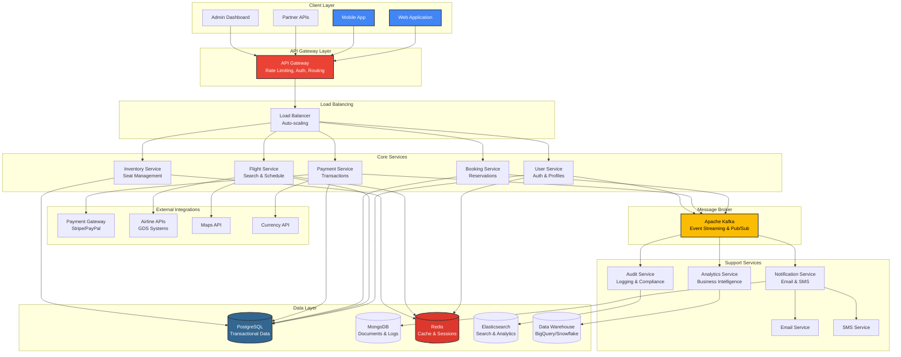
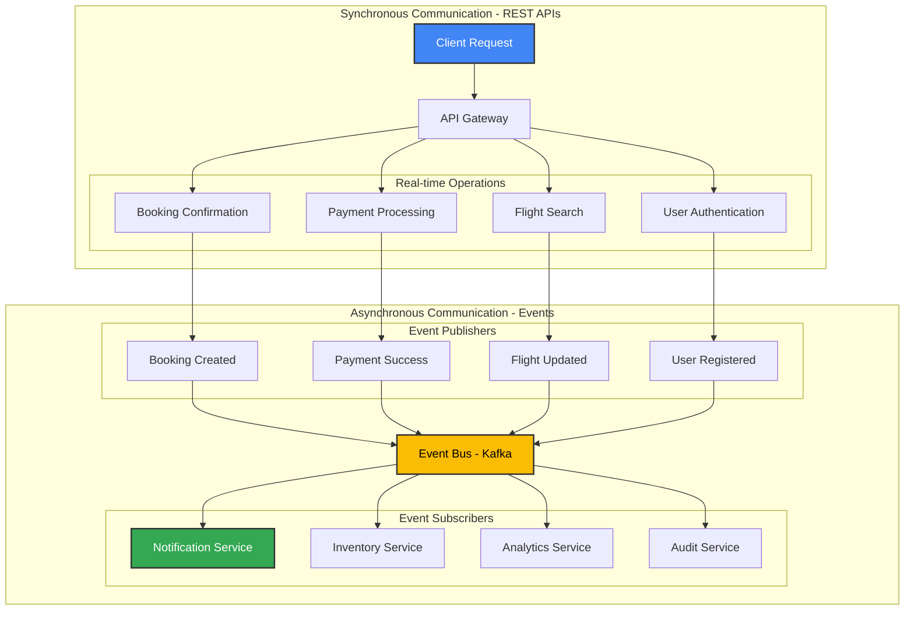
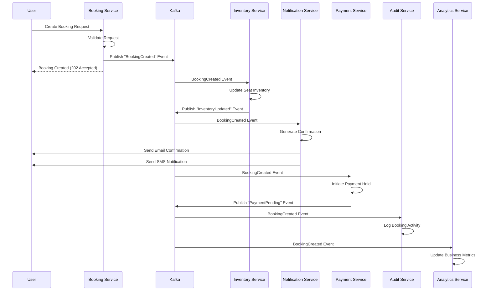
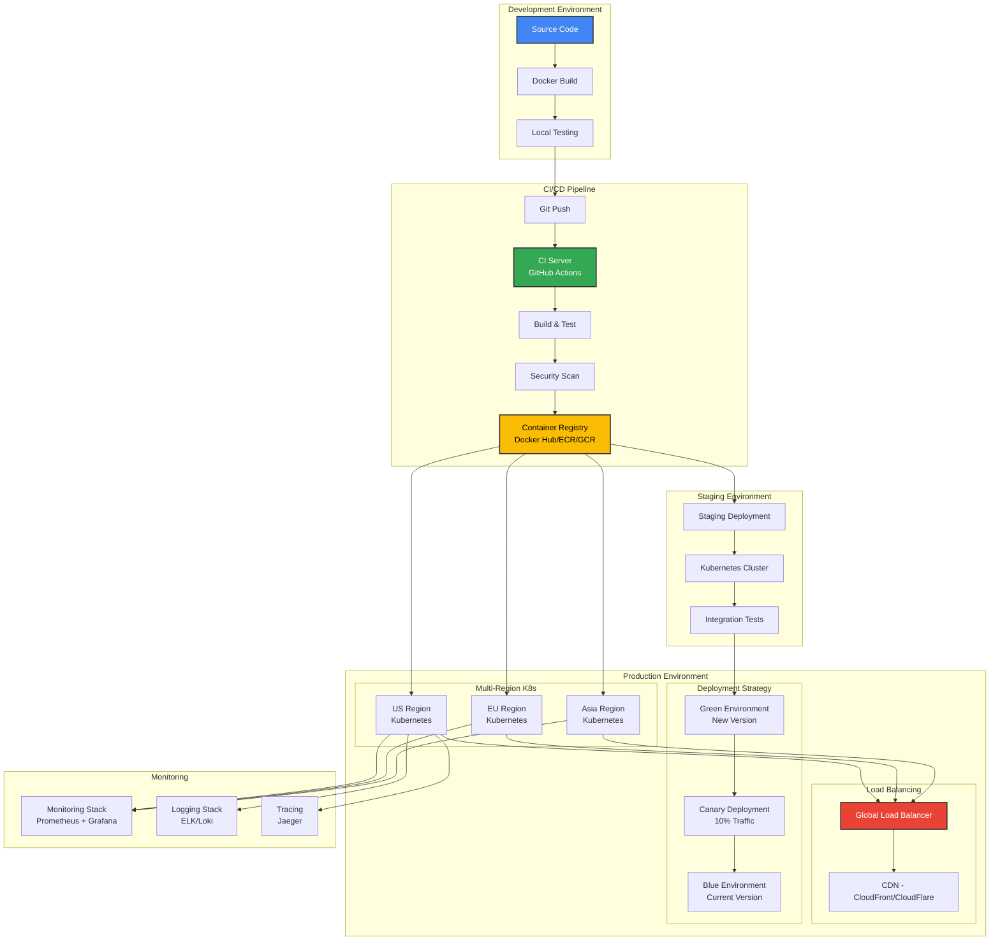

# System Architecture Design

## 🏗️ Architecture Overview

The Flight Booking System follows a **microservices architecture** pattern with event-driven communication, designed for high scalability, fault tolerance, and maintainability.

## 🎯 Architecture Principles

1. **Single Responsibility**: Each service owns a specific business domain
2. **Loose Coupling**: Services communicate through well-defined APIs
3. **High Cohesion**: Related functionality is grouped together
4. **Data Ownership**: Each service manages its own data
5. **Fault Isolation**: Failures in one service don't cascade
6. **Horizontal Scalability**: Services can scale independently

## 🏢 High-Level Architecture



## 🎛️ Microservices Breakdown

### Core Business Services

#### 1. User Service
- **Purpose**: User authentication, authorization, profile management
- **Database**: PostgreSQL
- **Key Features**:
  - User registration/login
  - Profile management
  - Role-based access control
  - JWT token management
  - Password reset functionality

#### 2. Flight Service
- **Purpose**: Flight search, availability, scheduling
- **Database**: PostgreSQL + Redis (caching)
- **Key Features**:
  - Flight search and filtering
  - Real-time availability
  - Flight schedule management
  - Route optimization
  - Price calculation

#### 3. Booking Service
- **Purpose**: Reservation management, seat selection
- **Database**: PostgreSQL
- **Key Features**:
  - Booking creation/modification
  - Seat selection and management
  - Passenger information handling
  - Booking status tracking
  - Cancellation processing

#### 4. Payment Service
- **Purpose**: Payment processing, billing, refunds
- **Database**: PostgreSQL (encrypted)
- **Key Features**:
  - Multi-payment gateway integration
  - Secure payment processing
  - Refund management
  - Currency conversion
  - Payment fraud detection

#### 5. Inventory Service
- **Purpose**: Seat inventory, capacity management
- **Database**: PostgreSQL
- **Key Features**:
  - Real-time seat availability
  - Inventory updates
  - Overbooking management
  - Capacity optimization
  - Pricing rules engine

### Support Services

#### 6. Notification Service
- **Purpose**: Multi-channel communication
- **Database**: MongoDB
- **Key Features**:
  - Email notifications
  - SMS alerts
  - Push notifications
  - Template management
  - Delivery tracking

#### 7. Analytics Service
- **Purpose**: Business intelligence, reporting
- **Database**: Data Warehouse (BigQuery/Snowflake)
- **Key Features**:
  - Booking analytics
  - Revenue reporting
  - User behavior tracking
  - Performance metrics
  - Business dashboards

#### 8. Audit Service
- **Purpose**: System logging, compliance, security
- **Database**: Elasticsearch
- **Key Features**:
  - Activity logging
  - Security monitoring
  - Compliance reporting
  - Event sourcing
  - Fraud detection

### Infrastructure Services

#### 9. API Gateway
- **Purpose**: Request routing, rate limiting, authentication
- **Technology**: Kong/AWS API Gateway
- **Key Features**:
  - Request routing
  - Rate limiting
  - Authentication validation
  - Request/response transformation
  - API versioning

#### 10. Configuration Service
- **Purpose**: Centralized configuration management
- **Technology**: Consul/etcd
- **Key Features**:
  - Feature flags
  - Environment-specific configs
  - Dynamic configuration updates
  - Secret management

## 🗄️ Data Architecture

### Database Strategy

#### Primary Databases
- **PostgreSQL**: ACID transactions, complex queries
  - User data, bookings, payments, inventory
- **MongoDB**: Document storage, flexible schema
  - Logs, notifications, analytics data
- **Redis**: Caching, session storage
  - Flight search cache, user sessions
- **Elasticsearch**: Full-text search, analytics
  - Audit logs, search functionality

#### Data Partitioning Strategy
```
Users: Partitioned by user_id hash
Bookings: Partitioned by booking_date
Flights: Partitioned by route (origin-destination)
Payments: Partitioned by transaction_date
```

#### Caching Strategy
```
L1 Cache (Application): In-memory caching for frequently accessed data
L2 Cache (Redis): Distributed caching for search results, user sessions
L3 Cache (CDN): Static content caching for UI assets
```

## 🔄 Communication Patterns



### Event-Driven Architecture - Booking Flow



## 🏠 Technology Stack

### Backend Services
- **Runtime**: Node.js / Java Spring Boot / Python FastAPI
- **Databases**: PostgreSQL, MongoDB, Redis, Elasticsearch
- **Message Broker**: Apache Kafka / RabbitMQ
- **Cache**: Redis, Memcached
- **Search**: Elasticsearch

### Frontend
- **Web**: React.js / Vue.js
- **Mobile**: React Native / Flutter
- **Admin**: React Admin / Vue Admin

### Infrastructure
- **Container**: Docker
- **Orchestration**: Kubernetes
- **Cloud**: AWS / GCP / Azure
- **API Gateway**: Kong / AWS API Gateway
- **Monitoring**: Prometheus + Grafana
- **Logging**: ELK Stack (Elasticsearch, Logstash, Kibana)
- **Tracing**: Jaeger / Zipkin

### DevOps & CI/CD
- **Version Control**: Git
- **CI/CD**: GitHub Actions / GitLab CI / Jenkins
- **IaC**: Terraform / CloudFormation
- **Secrets**: HashiCorp Vault / AWS Secrets Manager

## 🔐 Security Architecture

### Authentication & Authorization
```
Client → API Gateway → Auth Service → JWT Validation → Service
```

### Data Security
- **Encryption at Rest**: Database-level encryption
- **Encryption in Transit**: TLS 1.3 for all communications
- **PCI DSS Compliance**: For payment data handling
- **GDPR Compliance**: For user data protection

### Network Security
- **API Rate Limiting**: Per user/IP rate limits
- **DDoS Protection**: Cloud-based DDoS mitigation
- **Firewall Rules**: Network-level access control
- **VPN Access**: Secure admin access

## 📈 Scalability Strategy

### Horizontal Scaling
- **Stateless Services**: All services designed to be stateless
- **Load Balancing**: Round-robin, least connections
- **Auto-scaling**: Based on CPU, memory, and request metrics
- **Database Scaling**: Read replicas, sharding

### Performance Optimization
- **Caching**: Multi-level caching strategy
- **CDN**: Global content delivery network
- **Database Optimization**: Indexing, query optimization
- **Connection Pooling**: Database connection management

### High Availability
- **Multi-Region Deployment**: Active-active setup
- **Circuit Breakers**: Fault tolerance patterns
- **Health Checks**: Service health monitoring
- **Graceful Degradation**: Fallback mechanisms

## 🔧 Development Architecture

### Code Organization
```
flight-booking/
├── services/
│   ├── user-service/
│   ├── flight-service/
│   ├── booking-service/
│   ├── payment-service/
│   └── notification-service/
├── shared/
│   ├── libraries/
│   ├── schemas/
│   └── utilities/
├── infrastructure/
│   ├── kubernetes/
│   ├── terraform/
│   └── docker/
└── tools/
    ├── scripts/
    └── monitoring/
```

### Service Structure (Example)
```
user-service/
├── src/
│   ├── controllers/
│   ├── services/
│   ├── models/
│   ├── middleware/
│   ├── routes/
│   └── utils/
├── tests/
├── docker/
├── package.json
└── README.md
```

## 🚀 Deployment Architecture

### Container Strategy



### Zero-Downtime Deployment
- **Blue-Green Deployment**: For critical services
- **Rolling Updates**: For gradual service updates
- **Canary Releases**: For risk mitigation
- **Database Migrations**: Backward-compatible changes

This architecture provides a solid foundation for building a scalable, maintainable, and robust flight booking system that can handle high traffic and complex business requirements while maintaining high availability and performance.