# Backend Application Architecture

## 🎯 Overview

This document outlines the backend application architecture for the Flight Booking System, focusing on scalable, reliable, and maintainable design patterns and implementation strategies.

## 🏗️ Architecture Principles

### Core Principles
1. **Domain-Driven Design (DDD)**: Clear business domain boundaries
2. **SOLID Principles**: Single responsibility, Open/closed, Liskov substitution, Interface segregation, Dependency inversion
3. **Clean Architecture**: Dependency inversion with clear layers
4. **Microservices Pattern**: Independent, loosely coupled services
5. **Event-Driven Architecture**: Asynchronous communication and eventual consistency
6. **CQRS**: Command Query Responsibility Segregation for complex operations
7. **Saga Pattern**: Distributed transaction management

### Design Goals
- **Scalability**: Handle millions of concurrent users
- **Reliability**: 99.99% uptime with graceful failure handling
- **Maintainability**: Clean code, modular design, comprehensive testing
- **Performance**: Sub-200ms response times for critical operations
- **Security**: Zero-trust architecture with defense in depth

## 🔧 Backend Technology Stack

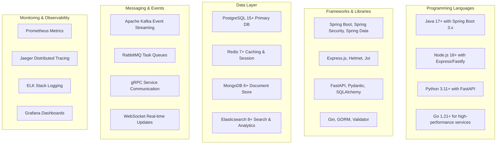

## 🏢 Service Architecture Pattern

### Hexagonal Architecture (Ports & Adapters)

Each microservice follows the hexagonal architecture pattern for maximum testability and maintainability:

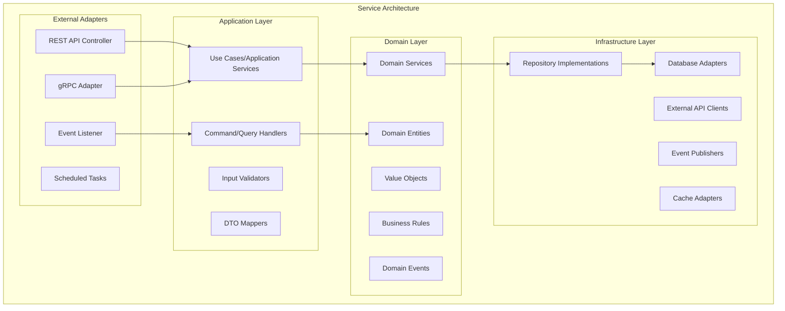

## 📊 Service-by-Service Architecture

### 1. User Service Architecture

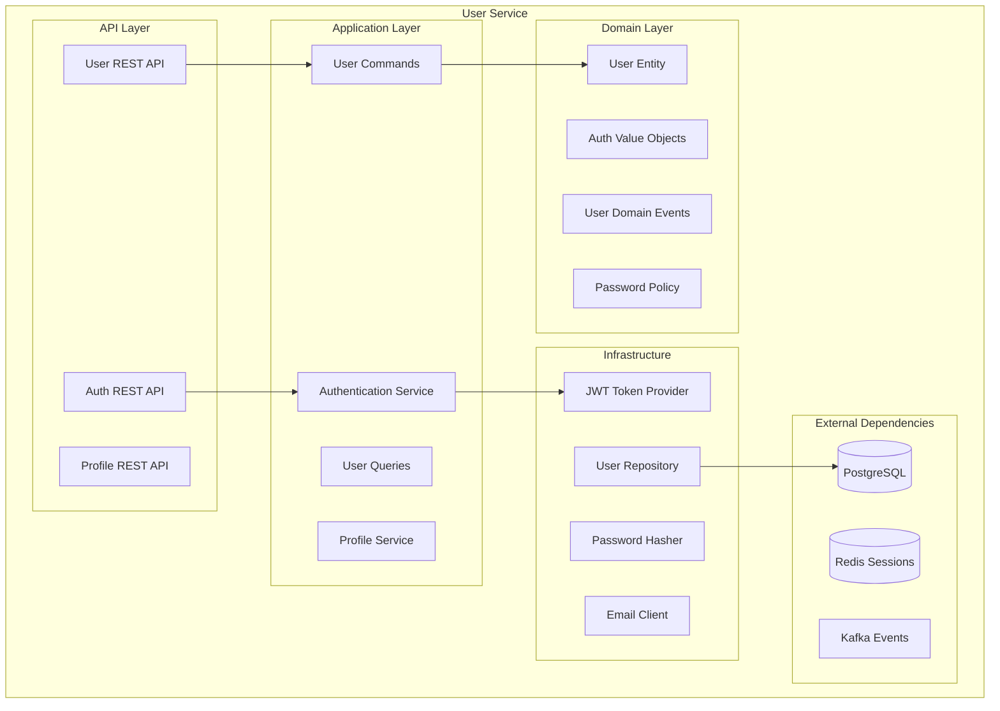

### 2. Flight Service Architecture

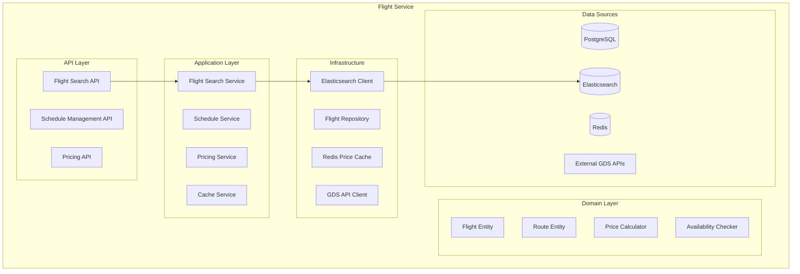

### 3. Booking Service Architecture

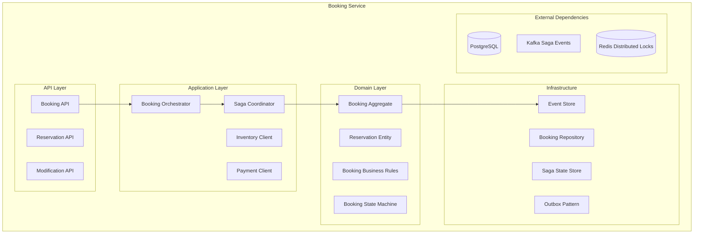

## 🔗 Inter-Service Communication Patterns

### 1. Synchronous Communication

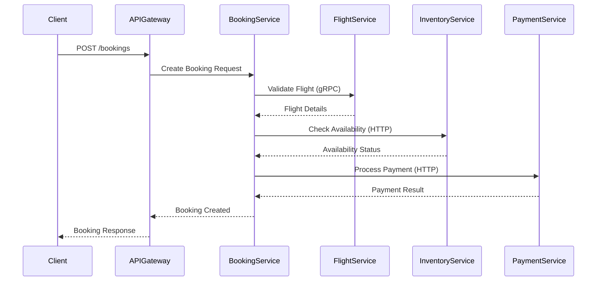

### 2. Asynchronous Communication (Event-Driven)

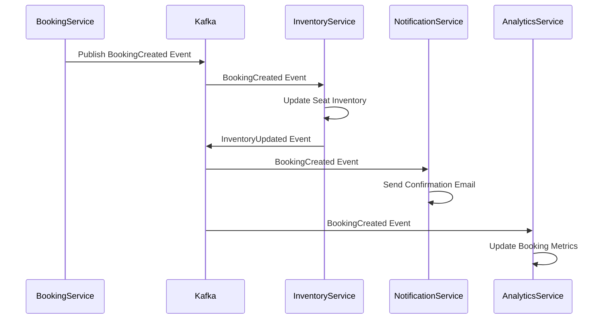

## 🔄 Data Management Patterns

### 1. Database per Service Pattern

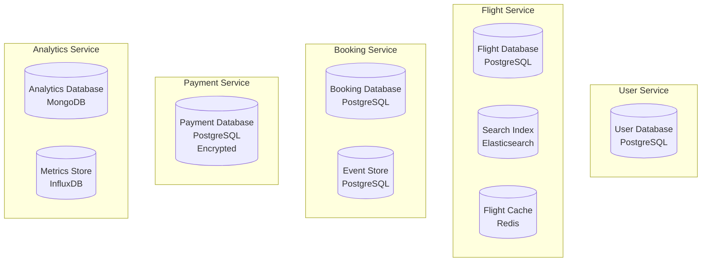

### 2. CQRS Pattern Implementation

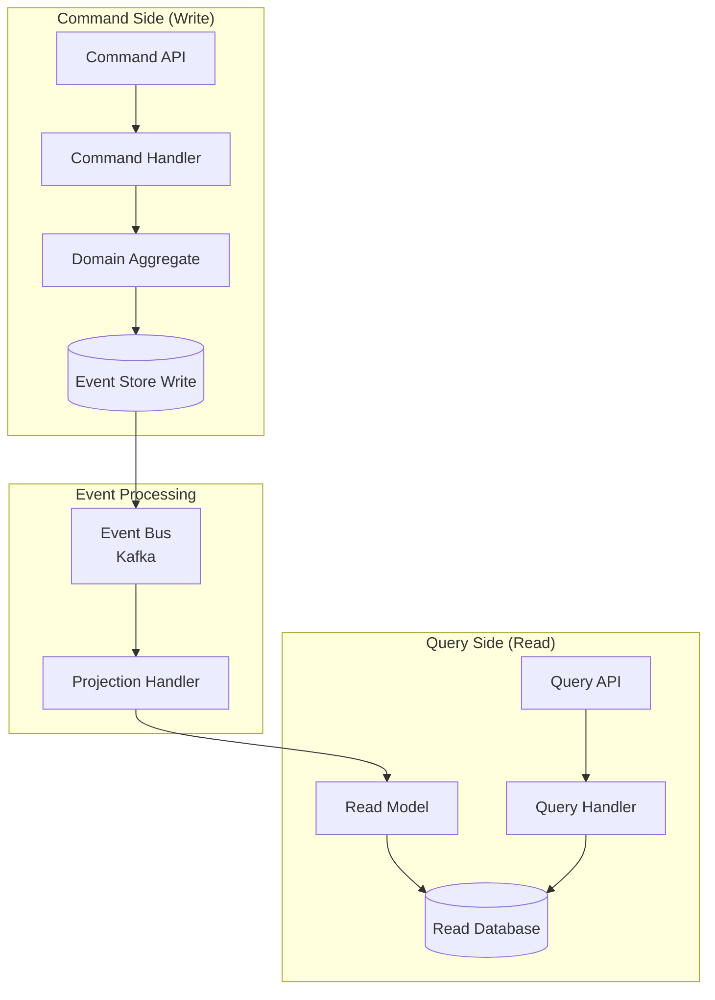

## 🔐 Security Architecture

### 1. Zero-Trust Security Model

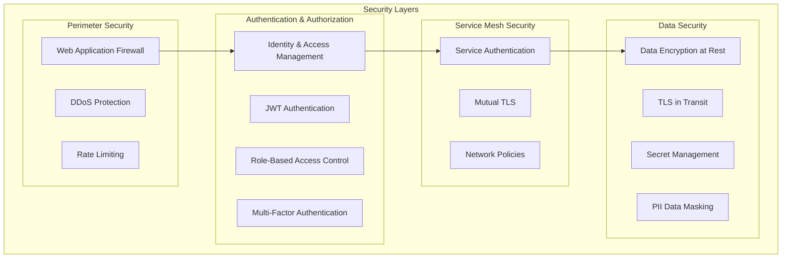

### 2. Authentication Flow

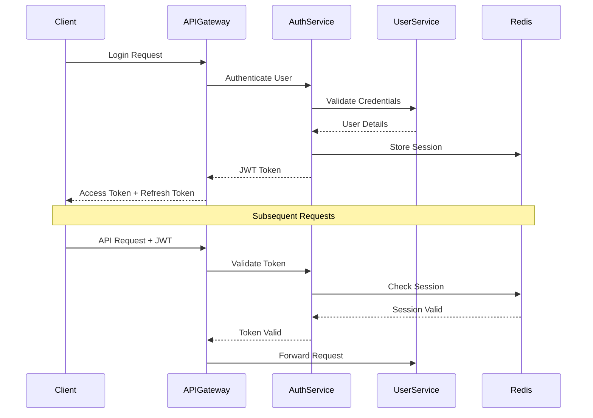

## 📈 Scalability Patterns

### 1. Horizontal Scaling Strategy

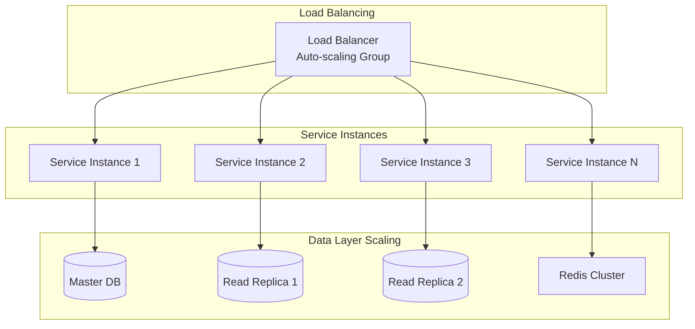

### 2. Caching Strategy

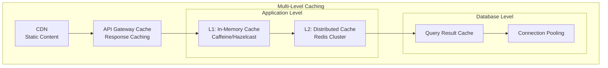

## 🔄 Resilience Patterns

### 1. Circuit Breaker Pattern

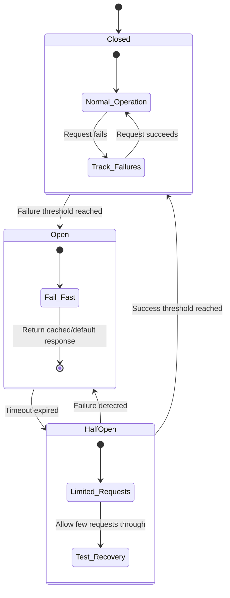

### 2. Retry with Exponential Backoff

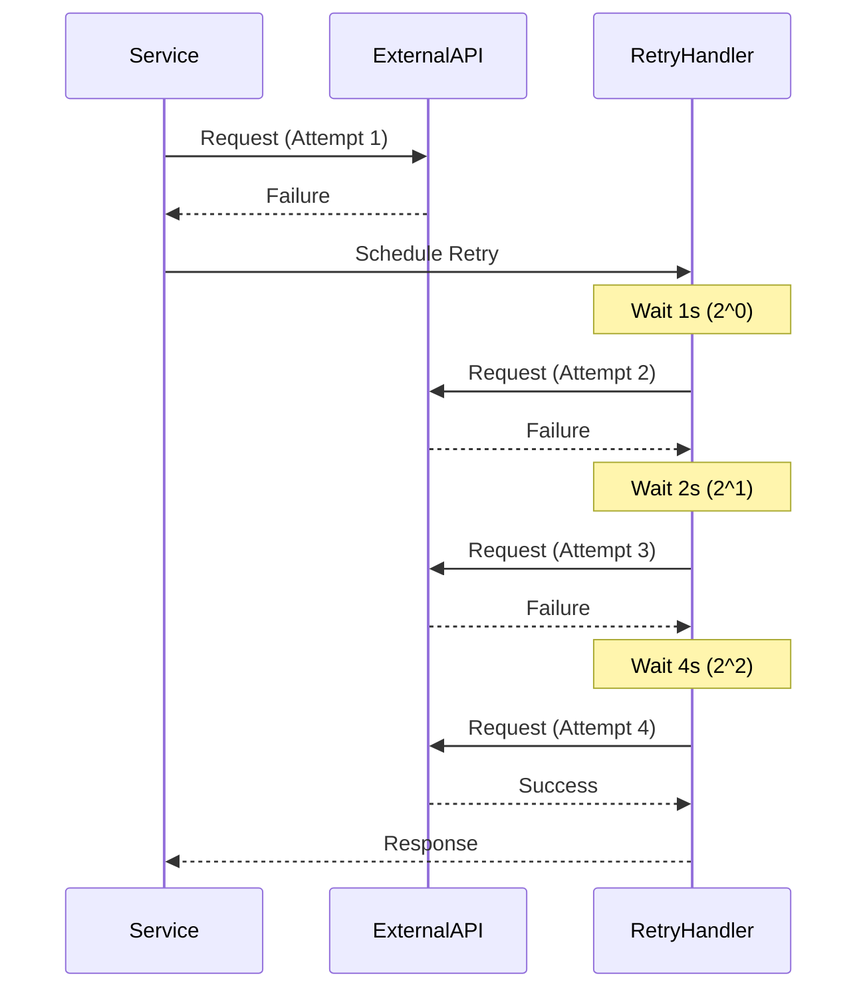

## 📊 Monitoring & Observability

### 1. Three Pillars of Observability

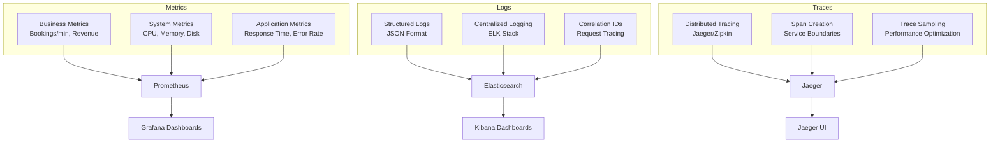

### 2. Health Check Architecture

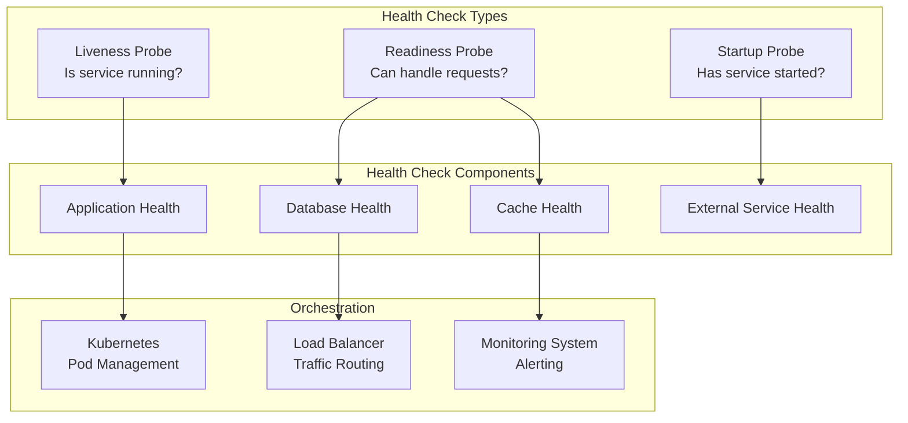

## 🧪 Testing Strategy

### 1. Testing Pyramid

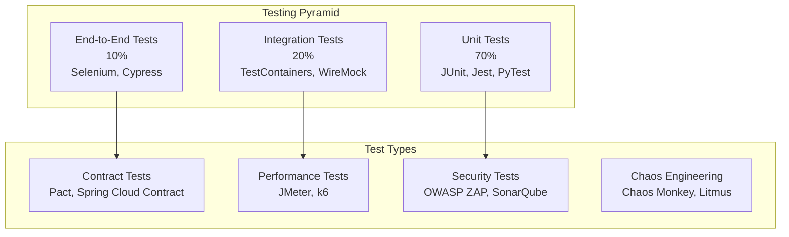

### 2. Testing Architecture per Service

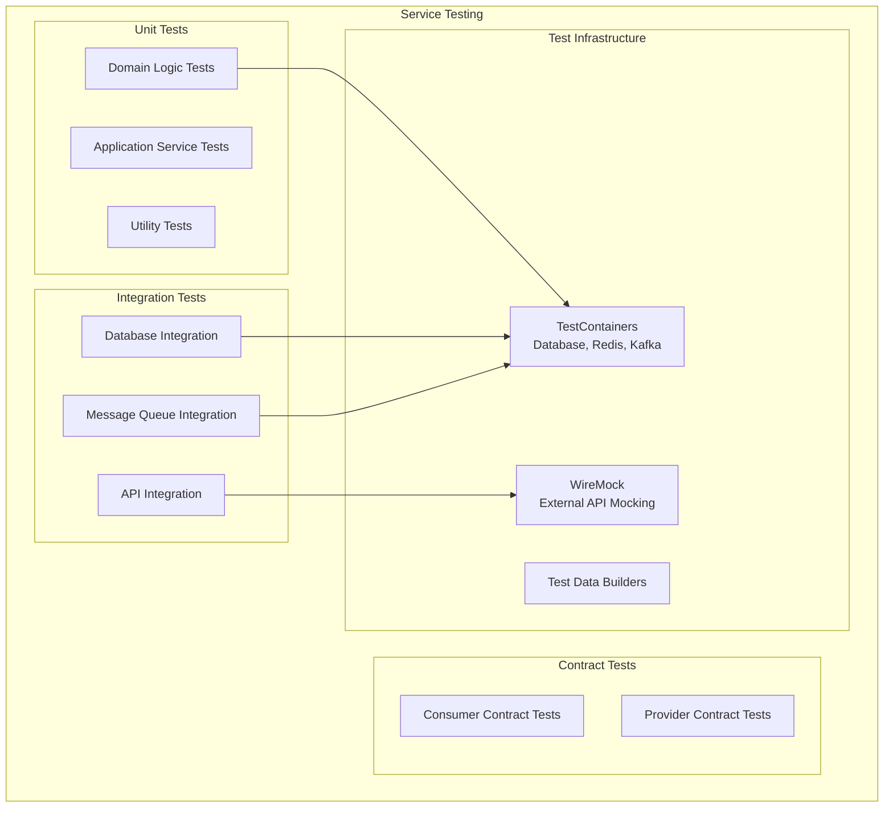

## 📋 Implementation Guidelines

### 1. Service Development Checklist

#### Domain Layer
- [ ] Define domain entities with business rules
- [ ] Implement value objects for type safety
- [ ] Create domain services for complex business logic
- [ ] Define domain events for cross-service communication
- [ ] Implement aggregate roots for consistency boundaries

#### Application Layer
- [ ] Create command and query handlers
- [ ] Implement use cases with clear boundaries
- [ ] Add input validation and sanitization
- [ ] Implement DTO mapping and transformation
- [ ] Add comprehensive error handling

#### Infrastructure Layer
- [ ] Implement repository patterns with interfaces
- [ ] Create database adapters with connection pooling
- [ ] Implement external API clients with retries
- [ ] Add caching layers with appropriate TTL
- [ ] Implement message publishers and consumers

#### API Layer
- [ ] Design RESTful APIs with proper HTTP methods
- [ ] Implement authentication and authorization
- [ ] Add request/response validation
- [ ] Implement rate limiting and throttling
- [ ] Add comprehensive API documentation

### 2. Code Quality Standards

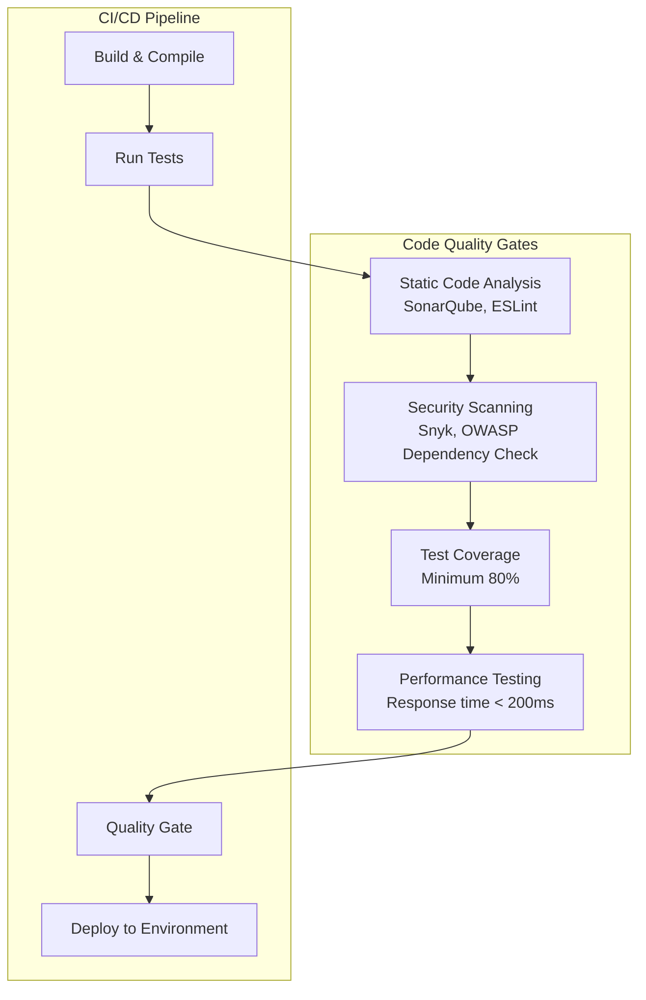

### 3. Performance Optimization Guidelines

#### Database Optimization
- Use connection pooling with appropriate pool sizes
- Implement database indexing strategies
- Use read replicas for read-heavy operations
- Implement database sharding for large datasets
- Use pagination for large result sets

#### Caching Strategy
- Implement multi-level caching (L1, L2, CDN)
- Use cache-aside pattern for frequently accessed data
- Implement cache warming for critical data
- Set appropriate TTL values based on data volatility
- Use cache invalidation strategies for data consistency

#### API Optimization
- Implement response compression (gzip)
- Use HTTP/2 for improved multiplexing
- Implement API versioning for backward compatibility
- Use appropriate HTTP status codes
- Implement request deduplication for idempotent operations

## 🚀 Deployment Architecture

### 1. Container Orchestration

```mermaid
graph TB
    subgraph "Kubernetes Cluster"
        subgraph "Control Plane"
            API_SERVER[API Server]
            SCHEDULER[Scheduler]
            CONTROLLER[Controller Manager]
            ETCD[(etcd)]
        end

        subgraph "Worker Nodes"
            subgraph "Node 1"
                KUBELET1[Kubelet]
                PROXY1[Kube-proxy]
                POD1[Service Pods]
            end

            subgraph "Node 2"
                KUBELET2[Kubelet]
                PROXY2[Kube-proxy]
                POD2[Service Pods]
            end

            subgraph "Node N"
                KUBELETN[Kubelet]
                PROXYN[Kube-proxy]
                PODN[Service Pods]
            end
        end

        subgraph "Storage"
            PV[Persistent Volumes]
            SC[Storage Classes]
        end

        subgraph "Networking"
            INGRESS[Ingress Controller]
            SERVICE_MESH[Service Mesh<br/>Istio]
            NETWORK_POLICY[Network Policies]
        end
    end

    API_SERVER --> KUBELET1
    API_SERVER --> KUBELET2
    API_SERVER --> KUBELETN
    POD1 --> PV
    POD2 --> PV
    PODN --> PV
```

### 2. Blue-Green Deployment Strategy

```mermaid
sequenceDiagram
    participant Developer
    participant CI_CD
    participant LoadBalancer
    participant BlueEnv
    participant GreenEnv
    participant Database

    Developer->>CI_CD: Push Code
    CI_CD->>CI_CD: Run Tests
    CI_CD->>GreenEnv: Deploy New Version
    GreenEnv->>Database: Run Migrations (if needed)
    CI_CD->>GreenEnv: Health Check
    CI_CD->>LoadBalancer: Switch Traffic to Green
    LoadBalancer->>GreenEnv: Route 100% Traffic
    CI_CD->>BlueEnv: Keep as Rollback Option
    
    Note over BlueEnv,GreenEnv: Monitor for Issues
    alt Rollback Needed
        CI_CD->>LoadBalancer: Switch Traffic to Blue
        LoadBalancer->>BlueEnv: Route 100% Traffic
    else Success
        CI_CD->>BlueEnv: Terminate Old Version
    end
```

## 📚 Best Practices Summary

### Development Best Practices
1. **Follow SOLID principles** for maintainable code
2. **Implement comprehensive testing** at all levels
3. **Use dependency injection** for loose coupling
4. **Apply defensive programming** for error handling
5. **Document APIs** with OpenAPI/Swagger specifications
6. **Use semantic versioning** for API compatibility
7. **Implement proper logging** with correlation IDs
8. **Follow security best practices** (OWASP guidelines)

### Operational Best Practices
1. **Implement health checks** for all services
2. **Use infrastructure as code** (Terraform, Helm)
3. **Monitor all critical metrics** and set up alerts
4. **Implement distributed tracing** for debugging
5. **Use feature flags** for safe deployments
6. **Automate security scanning** in CI/CD pipelines
7. **Regular security updates** and vulnerability patching
8. **Implement disaster recovery** and backup strategies

### Performance Best Practices
1. **Profile application performance** regularly
2. **Optimize database queries** and use proper indexing
3. **Implement caching strategies** at multiple levels
4. **Use connection pooling** for database connections
5. **Implement rate limiting** to prevent abuse
6. **Monitor and optimize memory usage**
7. **Use asynchronous processing** for long-running tasks
8. **Implement circuit breakers** for external service calls

This backend architecture provides a solid foundation for building a scalable, reliable, and maintainable flight booking system. Each component is designed to work independently while contributing to the overall system resilience and performance.