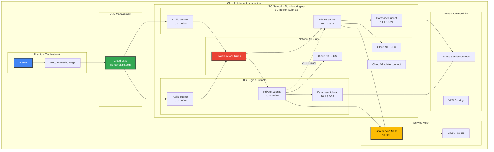
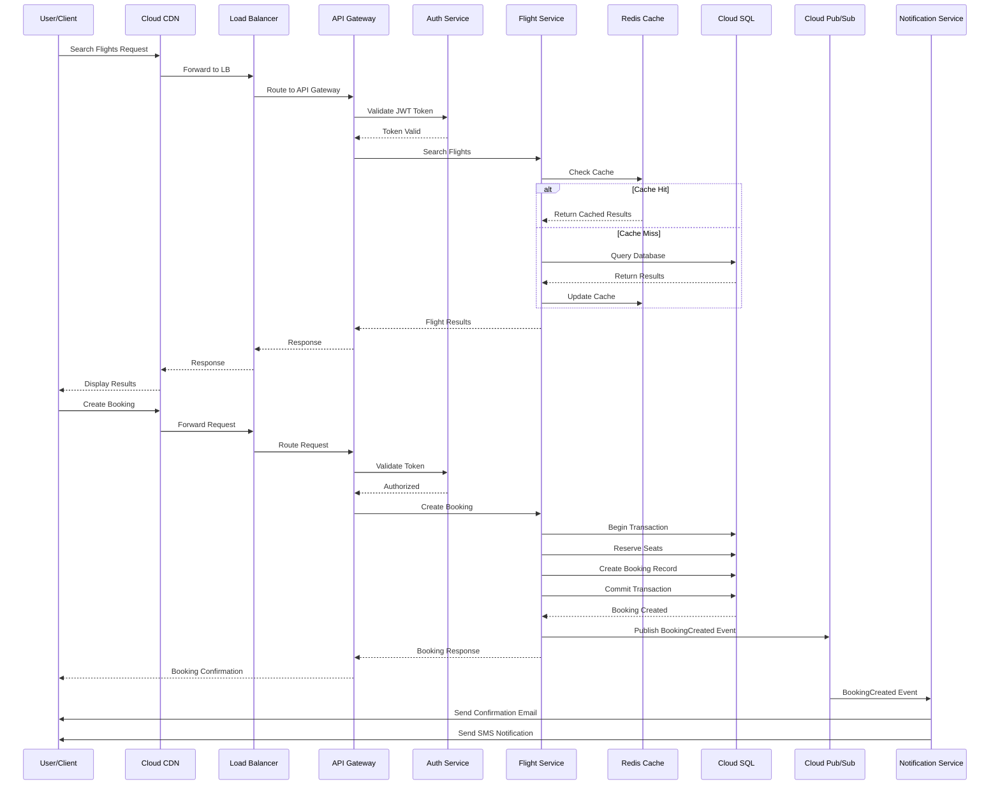
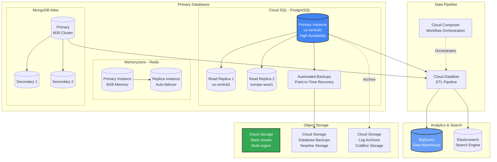
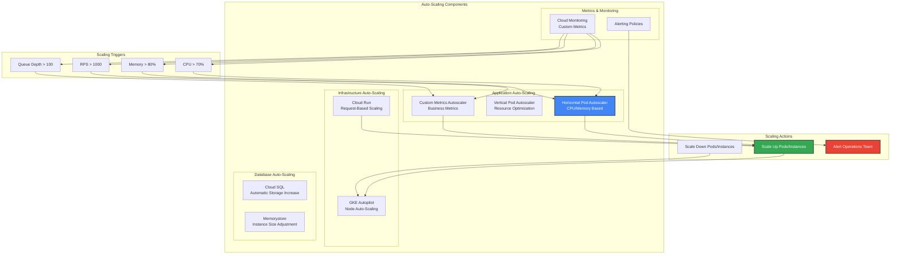
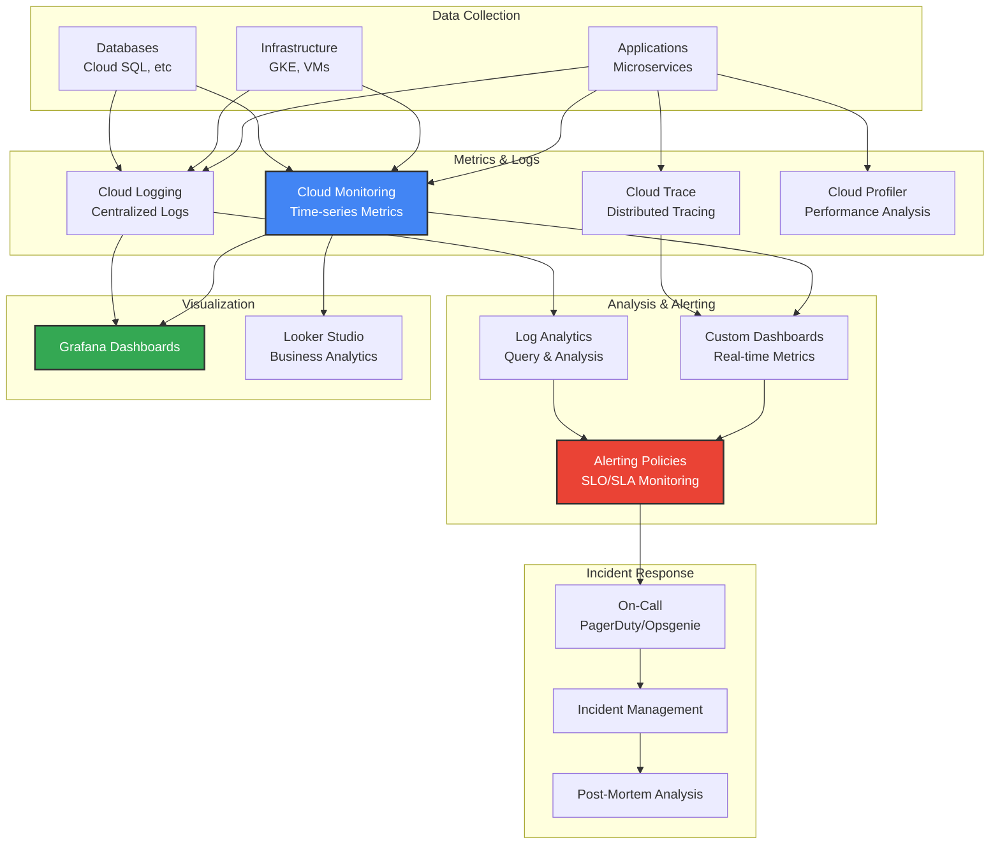
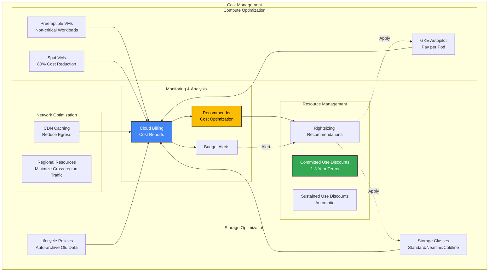

```mermaid
graph TB
    subgraph "Security Layers"
        subgraph "Perimeter Security"
            ARMOR[Cloud Armor<br/>WAF & DDoS]
            RECAPTCHA[reCAPTCHA Enterprise]
        end
        
        subgraph "Identity & Access"
            IAM[Cloud IAM<br/>Role-Based Access]
            IDENTITY[Identity Platform<br/>User Auth]
            WORKLOAD[Workload Identity<br/>Service Auth]
        end
        
        subgraph "Data Security"
            KMS[Cloud KMS<br/>Encryption Keys]
            SECRET[Secret Manager<br/>Credentials]
            DLP[Cloud DLP<br/>Data Loss Prevention]
        end
        
        subgraph "Network Security"
            FW[VPC Firewall]
            SSL[Managed SSL Certs]
            PRIVATE[Private Google Access]
            VPC_SC[VPC Service Controls]
        end
        
        subgraph "Application Security"
            BIN_AUTH[Binary Authorization<br/>Container Security]
            VULN[Container Analysis<br/>Vulnerability Scanning]
            SECURITY_CMD[Security Command Center]
        end
        
        subgraph "Compliance & Audit"
            AUDIT[Cloud Audit Logs]
            ACCESS[Access Transparency]
            COMPLIANCE[Compliance Reports<br/>PCI DSS, SOC2]
        end
    end

    ARMOR --> IAM
    RECAPTCHA --> IDENTITY
    IDENTITY --> WORKLOAD
    
    WORKLOAD --> KMS
    KMS --> SECRET
    SECRET --> DLP
    
    IAM --> FW
    FW --> SSL
    SSL --> PRIVATE
    PRIVATE --> VPC_SC
    
    VPC_SC --> BIN_AUTH
    BIN_AUTH --> VULN
    VULN --> SECURITY_CMD
    
    SECURITY_CMD --> AUDIT
    AUDIT --> ACCESS
    ACCESS --> COMPLIANCE

    style ARMOR fill:#ea4335,stroke:#333,stroke-width:2px,color:#fff
    style KMS fill:#4285f4,stroke:#333,stroke-width:2px,color:#fff
    style COMPLIANCE fill:#34a853,stroke:#333,stroke-width:2px,color:#fff
```

```mermaid
graph TB
    subgraph "GKE Autopilot Cluster - flight-booking-cluster"
        subgraph "System Namespaces"
            KUBE_SYS[kube-system<br/>Core Components]
            ISTIO_SYS[istio-system<br/>Service Mesh]
            MONITORING[monitoring<br/>Prometheus Stack]
        end
        
        subgraph "Application Namespaces"
            subgraph "Production Namespace"
                PROD_DEPLOY[Deployments]
                
                subgraph "User Service"
                    USER_POD1[Pod 1]
                    USER_POD2[Pod 2]
                    USER_POD3[Pod 3]
                    USER_SVC[Service]
                    USER_HPA[HPA]
                end
                
                subgraph "Flight Service"
                    FLIGHT_POD1[Pod 1]
                    FLIGHT_POD2[Pod 2]
                    FLIGHT_POD3[Pod 3]
                    FLIGHT_SVC[Service]
                    FLIGHT_HPA[HPA]
                end
                
                subgraph "Booking Service"
                    BOOKING_POD1[Pod 1]
                    BOOKING_POD2[Pod 2]
                    BOOKING_SVC[Service]
                    BOOKING_HPA[HPA]
                end
                
                INGRESS[Ingress Controller<br/>nginx/GKE Ingress]
            end
            
            subgraph "Staging Namespace"
                STAGING[Staging Deployments<br/>Mirror of Production]
            end
        end
        
        subgraph "Persistent Storage"
            PVC1[PVC - Logs]
            PVC2[PVC - Config]
        end
        
        subgraph "ConfigMaps & Secrets"
            CM[ConfigMaps]
            SEC[Secrets<br/>from Secret Manager]
        end
    end
    
    subgraph "External Resources"
        SQL[(Cloud SQL)]
        REDIS[(Memorystore)]
        PUBSUB[Cloud Pub/Sub]
    end

    INGRESS --> USER_SVC
    INGRESS --> FLIGHT_SVC
    INGRESS --> BOOKING_SVC
    
    USER_SVC --> USER_POD1
    USER_SVC --> USER_POD2
    USER_SVC --> USER_POD3
    USER_HPA -.Auto-scale.-> USER_POD1
    
    FLIGHT_SVC --> FLIGHT_POD1
    FLIGHT_SVC --> FLIGHT_POD2
    FLIGHT_SVC --> FLIGHT_POD3
    FLIGHT_HPA -.Auto-scale.-> FLIGHT_POD1
    
    BOOKING_SVC --> BOOKING_POD1
    BOOKING_SVC --> BOOKING_POD2
    BOOKING_HPA -.Auto-scale.-> BOOKING_POD1
    
    USER_POD1 --> CM
    USER_POD1 --> SEC
    USER_POD1 --> SQL
    USER_POD1 --> REDIS
    
    FLIGHT_POD1 --> SQL
    FLIGHT_POD1 --> REDIS
    
    BOOKING_POD1 --> SQL
    BOOKING_POD1 --> PUBSUB
    
    ISTIO_SYS -.Manages.-> USER_POD1
    ISTIO_SYS -.Manages.-> FLIGHT_POD1
    ISTIO_SYS -.Manages.-> BOOKING_POD1
    
    MONITORING -.Monitors.-> USER_POD1
    MONITORING -.Monitors.-> FLIGHT_POD1
    MONITORING -.Monitors.-> BOOKING_POD1

    style INGRESS fill:#4285f4,stroke:#333,stroke-width:2px,color:#fff
    style USER_SVC fill:#34a853,stroke:#333,stroke-width:2px,color:#fff
    style FLIGHT_SVC fill:#34a853,stroke:#333,stroke-width:2px,color:#fff
    style BOOKING_SVC fill:#34a853,stroke:#333,stroke-width:2px,color:#fff
    style ISTIO_SYS fill:#fbbc04,stroke:#333,stroke-width:2px,color:#000
```

# GCP Deployment Architecture

## 🌐 Google Cloud Platform Architecture Overview

This document outlines the complete deployment architecture for the Flight Booking System on Google Cloud Platform (GCP).

## 🏗️ High-Level Architecture

```mermaid
graph TB
    subgraph "Client Layer"
        WEB[Web Browser]
        MOBILE[Mobile App]
        PARTNER[Partner APIs]
    end

    subgraph "Edge Layer - Cloud CDN"
        CDN[Cloud CDN]
        ARMOR[Cloud Armor<br/>DDoS Protection]
    end

    subgraph "Global Load Balancing"
        GLB[Global HTTP Load Balancer]
        SSL[SSL Certificates<br/>Managed]
    end

    subgraph "Multi-Region Deployment"
        subgraph "US Region - us-central1"
            subgraph "Frontend Tier"
                US_FE1[Cloud Run<br/>Web App]
                US_FE2[Cloud Run<br/>Web App]
            end
            
            subgraph "API Gateway Tier"
                US_APIGW[API Gateway<br/>Kong/Apigee]
            end
            
            subgraph "Application Tier - GKE Cluster"
                US_GKE[GKE Autopilot Cluster]
                subgraph "Microservices Pods"
                    US_USER[User Service]
                    US_FLIGHT[Flight Service]
                    US_BOOKING[Booking Service]
                    US_PAYMENT[Payment Service]
                    US_NOTIFY[Notification Service]
                end
            end
            
            subgraph "Data Tier"
                US_PSQL[(Cloud SQL<br/>PostgreSQL)]
                US_REDIS[(Memorystore<br/>Redis)]
                US_MONGO[(MongoDB Atlas)]
            end
        end

        subgraph "EU Region - europe-west1"
            subgraph "Frontend Tier EU"
                EU_FE1[Cloud Run<br/>Web App]
                EU_FE2[Cloud Run<br/>Web App]
            end
            
            subgraph "API Gateway Tier EU"
                EU_APIGW[API Gateway]
            end
            
            subgraph "Application Tier EU - GKE Cluster"
                EU_GKE[GKE Autopilot Cluster]
                subgraph "Microservices Pods EU"
                    EU_USER[User Service]
                    EU_FLIGHT[Flight Service]
                    EU_BOOKING[Booking Service]
                    EU_PAYMENT[Payment Service]
                    EU_NOTIFY[Notification Service]
                end
            end
            
            subgraph "Data Tier EU"
                EU_PSQL[(Cloud SQL<br/>PostgreSQL)]
                EU_REDIS[(Memorystore<br/>Redis)]
                EU_MONGO[(MongoDB Atlas)]
            end
        end
    end

    subgraph "Message & Event Layer"
        PUBSUB[Cloud Pub/Sub<br/>Event Streaming]
    end

    subgraph "Data & Analytics"
        BQ[BigQuery<br/>Data Warehouse]
        ES[Elasticsearch<br/>on GCE]
        DATAFLOW[Dataflow<br/>Stream Processing]
    end

    subgraph "Storage Layer"
        GCS[Cloud Storage<br/>Static Assets & Backups]
        FILESTORE[Filestore<br/>Shared Files]
    end

    subgraph "Security & Identity"
        IAM[Cloud IAM]
        KMS[Cloud KMS<br/>Key Management]
        SECRET[Secret Manager]
        VPC[VPC Service Controls]
    end

    subgraph "Monitoring & Operations"
        MONITOR[Cloud Monitoring]
        LOGGING[Cloud Logging]
        TRACE[Cloud Trace]
        PROFILER[Cloud Profiler]
        ERROR[Error Reporting]
    end

    subgraph "External Services"
        STRIPE[Stripe API<br/>Payments]
        TWILIO[Twilio<br/>SMS]
        SENDGRID[SendGrid<br/>Email]
        AIRLINE[Airline APIs<br/>GDS Systems]
    end

    WEB --> CDN
    MOBILE --> CDN
    PARTNER --> CDN
    CDN --> ARMOR
    ARMOR --> GLB
    GLB --> SSL
    
    SSL --> US_FE1
    SSL --> US_FE2
    SSL --> EU_FE1
    SSL --> EU_FE2
    
    US_FE1 --> US_APIGW
    US_FE2 --> US_APIGW
    EU_FE1 --> EU_APIGW
    EU_FE2 --> EU_APIGW
    
    US_APIGW --> US_GKE
    EU_APIGW --> EU_GKE
    
    US_GKE --> US_USER
    US_GKE --> US_FLIGHT
    US_GKE --> US_BOOKING
    US_GKE --> US_PAYMENT
    US_GKE --> US_NOTIFY
    
    EU_GKE --> EU_USER
    EU_GKE --> EU_FLIGHT
    EU_GKE --> EU_BOOKING
    EU_GKE --> EU_PAYMENT
    EU_GKE --> EU_NOTIFY
    
    US_USER --> US_PSQL
    US_FLIGHT --> US_PSQL
    US_BOOKING --> US_PSQL
    US_PAYMENT --> US_PSQL
    US_NOTIFY --> US_MONGO
    
    EU_USER --> EU_PSQL
    EU_FLIGHT --> EU_PSQL
    EU_BOOKING --> EU_PSQL
    EU_PAYMENT --> EU_PSQL
    EU_NOTIFY --> EU_MONGO
    
    US_USER --> US_REDIS
    US_FLIGHT --> US_REDIS
    EU_USER --> EU_REDIS
    EU_FLIGHT --> EU_REDIS
    
    US_BOOKING --> PUBSUB
    EU_BOOKING --> PUBSUB
    PUBSUB --> US_NOTIFY
    PUBSUB --> EU_NOTIFY
    PUBSUB --> DATAFLOW
    
    DATAFLOW --> BQ
    US_GKE --> LOGGING
    EU_GKE --> LOGGING
    LOGGING --> ES
    
    US_PAYMENT --> STRIPE
    US_NOTIFY --> TWILIO
    US_NOTIFY --> SENDGRID
    US_FLIGHT --> AIRLINE
    
    US_FE1 --> GCS
    EU_FE1 --> GCS
    
    US_PSQL -.Replication.-> EU_PSQL
    EU_PSQL -.Replication.-> US_PSQL
    
    IAM --> US_GKE
    IAM --> EU_GKE
    KMS --> US_PSQL
    KMS --> EU_PSQL
    SECRET --> US_GKE
    SECRET --> EU_GKE
    
    MONITOR --> US_GKE
    MONITOR --> EU_GKE
    TRACE --> US_GKE
    TRACE --> EU_GKE

    style WEB fill:#4285f4,stroke:#333,stroke-width:2px,color:#fff
    style MOBILE fill:#4285f4,stroke:#333,stroke-width:2px,color:#fff
    style CDN fill:#34a853,stroke:#333,stroke-width:2px,color:#fff
    style GLB fill:#fbbc04,stroke:#333,stroke-width:2px,color:#000
    style US_GKE fill:#ea4335,stroke:#333,stroke-width:2px,color:#fff
    style EU_GKE fill:#ea4335,stroke:#333,stroke-width:2px,color:#fff
    style PUBSUB fill:#4285f4,stroke:#333,stroke-width:2px,color:#fff
    style BQ fill:#669df6,stroke:#333,stroke-width:2px,color:#fff
```

## 🌍 Network Architecture

## 🔐 Security Architecture

## 📊 Data Flow Architecture

## 🚀 GKE Cluster Architecture

## 💾 Data Storage Architecture

## 📈 Auto-Scaling Strategy

## 🔄 CI/CD Pipeline on GCP

```mermaid
graph LR
    subgraph "Source Control"
        GIT[GitHub Repository]
    end
    
    subgraph "Build & Test - Cloud Build"
        TRIGGER[Cloud Build Trigger]
        BUILD[Build Docker Images]
        TEST[Run Tests<br/>Unit & Integration]
        SCAN[Security Scan<br/>Container Analysis]
    end
    
    subgraph "Artifact Storage"
        AR[Artifact Registry<br/>Docker Images]
    end
    
    subgraph "Deployment"
        subgraph "Staging"
            DEPLOY_STG[Deploy to GKE Staging]
            TEST_STG[Smoke Tests]
        end
        
        subgraph "Production"
            APPROVE[Manual Approval]
            DEPLOY_PROD[Blue-Green Deploy<br/>to Production]
            VERIFY[Health Checks]
            ROLLBACK{Success?}
        end
    end
    
    subgraph "Monitoring"
        MONITOR[Cloud Monitoring<br/>Track Deployment]
        ALERT[Alert on Failure]
    end

    GIT -->|Push| TRIGGER
    TRIGGER --> BUILD
    BUILD --> TEST
    TEST -->|Pass| SCAN
    SCAN -->|Pass| AR
    
    AR --> DEPLOY_STG
    DEPLOY_STG --> TEST_STG
    TEST_STG -->|Pass| APPROVE
    
    APPROVE -->|Approved| DEPLOY_PROD
    DEPLOY_PROD --> VERIFY
    VERIFY --> ROLLBACK
    ROLLBACK -->|Success| MONITOR
    ROLLBACK -->|Failure| ALERT
    ALERT -.Automatic Rollback.-> DEPLOY_PROD

    style GIT fill:#4285f4,stroke:#333,stroke-width:2px,color:#fff
    style BUILD fill:#34a853,stroke:#333,stroke-width:2px,color:#fff
    style DEPLOY_PROD fill:#fbbc04,stroke:#333,stroke-width:2px,color:#000
    style ROLLBACK fill:#ea4335,stroke:#333,stroke-width:2px,color:#fff
```

## 📊 Monitoring & Observability

## 💰 Cost Optimization Strategy

## 🔧 GCP Services Summary

| Category | Service | Purpose |
|----------|---------|---------|
| **Compute** | GKE Autopilot | Kubernetes cluster for microservices |
| | Cloud Run | Serverless containers for frontend |
| | Compute Engine | Custom VMs for specialized workloads |
| **Storage** | Cloud SQL | PostgreSQL managed database |
| | Memorystore | Redis cache |
| | Cloud Storage | Object storage for files/backups |
| **Networking** | Cloud Load Balancing | Global HTTP(S) load balancing |
| | Cloud CDN | Content delivery network |
| | Cloud Armor | DDoS protection & WAF |
| | Cloud DNS | DNS management |
| **Data & Analytics** | BigQuery | Data warehouse |
| | Cloud Pub/Sub | Message queue & event streaming |
| | Dataflow | Stream/batch data processing |
| **Security** | Cloud IAM | Identity & access management |
| | Cloud KMS | Encryption key management |
| | Secret Manager | Secrets management |
| | Security Command Center | Security & compliance monitoring |
| **Operations** | Cloud Monitoring | Metrics & dashboards |
| | Cloud Logging | Centralized logging |
| | Cloud Trace | Distributed tracing |
| | Error Reporting | Error tracking |
| **CI/CD** | Cloud Build | Build & deployment automation |
| | Artifact Registry | Container image registry |
| | Binary Authorization | Container security |
| **AI/ML** | Vertex AI | ML model deployment (future) |
| | Recommendations AI | Personalization (future) |

This GCP architecture provides a production-ready, scalable, and secure infrastructure for the Flight Booking System with industry best practices and cost optimization strategies.